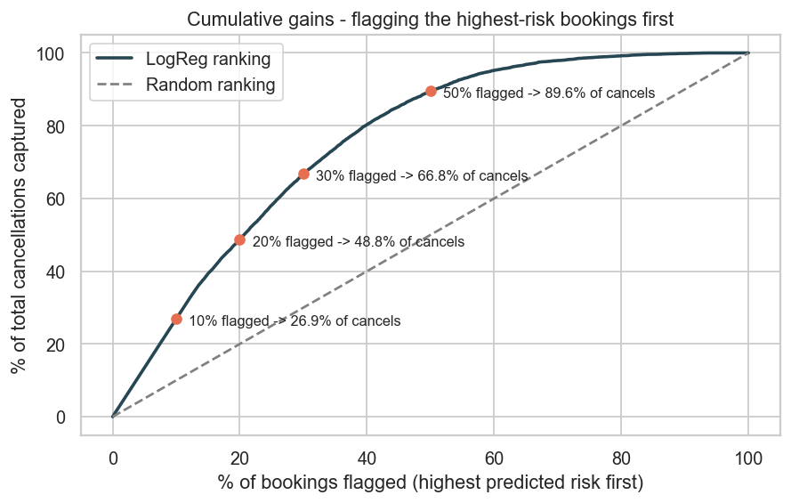
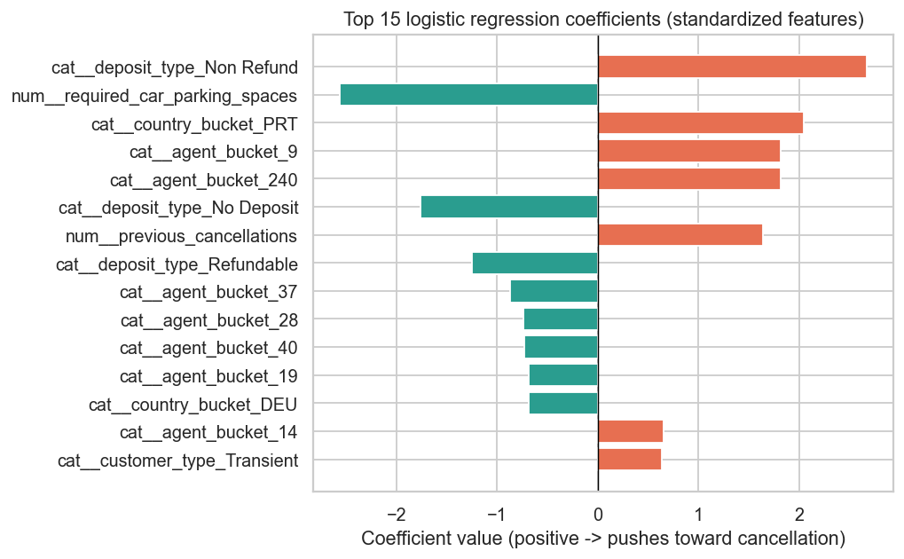

### Predicting Hotel Booking Cancellations

**Author:** Siva Prasad Ampavatina

#### Executive summary
About 37% of hotel bookings end in cancellation. Hotels overbook to compensate, which means they need a per-booking risk score, not a hand-coded rule. This project builds a baseline cancellation classifier on 119,000 bookings from two Portuguese hotels (Antonio et al. 2019). A class-weighted Logistic Regression reaches ROC-AUC = 0.9079 on the held-out test set, and flagging the top 30% of riskiest bookings captures 66.8% of all real cancellations - a 2.2x lift over random flagging. Lead time, deposit type, and country of origin are the strongest signals.

#### Rationale
Cancellations create real operational pain. An empty room is lost revenue. A walked guest at check-in is a brand-damage event the front desk dreads. Today, revenue management balances these by overbooking based on rough seasonal averages. A per-booking risk score lets them be more surgical: route confident-cancel bookings into a deeper overbooking pool, route confident-keep bookings into the protected-inventory pool, and treat the middle differently from either extreme.

This is the second dataset for this capstone:
1. The original Module 16 idea was a defect-prediction model on internal SIT/UAT bug-tracker data. Initial plan was to use the data from the company I work with. Though discussions with the immmediate managers was fine, I did not get the approvals from the security team and hence I had to look for a different dataset. 
2. I chose another dataset, Hotel booking demand datasets, from the Tidy Tuesday repo as mentioned in the Data Sources section below. Hotel Booking Demand keeps the same shape of question as the original idea (predict an outcome so the team can plan resources), and uses public data.

#### Research Question
Which booking attributes most strongly predict whether a reservation will be canceled, and how much lift does a baseline model give the revenue management team over the current overbook-by-seasonal-average approach?

#### Data Sources
Hotel Booking Demand dataset.

- 119,390 bookings, 32 columns, comma-separated.
- Source: Antonio, N., Almeida, A. and Nunes, L. (2019). *Hotel booking demand datasets.* Data in Brief, 22, 41-49.
- Records cover one resort hotel and one city hotel in Portugal, with arrival dates from July 2015 to August 2017.
- Target: `is_canceled` in {0, 1}. 37.0% positive (canceled), so imbalanced but mild.
- Local copy at `data/hotel_bookings.csv`. Public mirror at the [Tidy Tuesday repo](https://github.com/rfordatascience/tidytuesday/blob/master/data/2020/2020-02-11/readme.md).

#### Methodology
1. **Loading.** Standard `pd.read_csv`.
2. **Cleaning.**
   - Drop `company` (94% missing - a corporate account ID that is rarely populated).
   - `agent` missing -> `'0'` and treated as a categorical bucket.
   - `country` missing -> `'UNK'`.
   - `children` missing -> 0 (only 4 rows).
   - Drop 180 bookings with `adults + children + babies == 0` (impossible).
   - Drop one booking with negative `adr`; cap `adr` at the 99.9th percentile to remove a known data-entry error around 5,400 EUR.
   - Merge `meal = 'Undefined'` into `meal = 'SC'` (self-catered) per the dataset documentation.
3. **Feature engineering.**
   - `total_nights`, `total_guests`, `is_family`, `room_assigned_as_reserved`, `arrival_month_num`, `arrival_date` derived from the raw fields.
   - `country` and `agent` bucketed to top-15 + `'OTHER'` so one-hot encoding stays manageable (177 country codes drop to 16; ~330 agent IDs drop to 16).
   - **Leakage exclusion:** `reservation_status` and `reservation_status_date` are dropped from the model. They literally describe what happened (Check-Out / Canceled / No-Show and the date of that status). The notebook prints a crosstab proving the perfect 1:1 mapping. Both columns are kept in the dataframe for EDA only.
4. **Outlier review.** Boxplots and IQR counts on `lead_time`, `adr`, `total_nights`, `previous_cancellations`. The long tails (bookings 700+ days out, guests with 26 prior cancellations) are real behavior, not data errors. Kept and standard-scaled rather than removed.
5. **Preprocessing pipeline.** `ColumnTransformer` with `StandardScaler` for the 20 numeric features and `OneHotEncoder(handle_unknown='ignore')` for the 9 categorical features, wrapped in a `Pipeline` so it is fit only on the training fold. Stratified 80/20 train/test split.
6. **Baseline model.** Logistic Regression with `class_weight='balanced'`, evaluated by 5-fold stratified cross-validation on the training set and a single held-out test set. Compared against `DummyClassifier(strategy='most_frequent')` so the trivial 63% accuracy floor is visible.
7. **Evaluation metric.** **ROC-AUC** is the primary metric. Revenue management does not need a hard yes/no per booking - they need a risk score they can rank by. ROC-AUC measures how well the model ranks bookings by cancellation risk, which is exactly what the team will consume. Average precision (PR-AUC), precision/recall/F1 at the 0.5 threshold, the precision-recall curve, the confusion matrix, and a cumulative-gains chart are all reported as secondary diagnostics.

#### Results

**Baseline model performance on the held-out test set (n = 23,842, 8,840 cancellations):**

| Metric | Value | Notes |
|---|---|---|
| ROC-AUC | **0.9079** | Primary metric. Strong ranking performance. |
| 5-fold CV ROC-AUC (train) | 0.9081 ± 0.0019 | Extremely stable across folds; no overfitting. |
| Average precision (PR-AUC) | 0.8661 | vs. 0.371 base rate - ~2.3x lift over random ranking. |
| Accuracy | 0.8223 | Above the 0.6292 dummy by ~19 points. |
| Precision (canceled) | 0.7337 | At the default 0.5 threshold. |
| Recall (canceled) | 0.8174 | Catches 82% of real cancellations at the default threshold. |
| F1 (canceled) | 0.7733 | |

**Lead-time effect (the strongest single feature):**

| Lead time | Bookings | Cancellation rate |
|---|---|---|
| 0-7 days | 19,635 | 9.6% |
| 8-30 days | 18,945 | 27.9% |
| 31-90 days | 29,529 | 37.7% |
| 91-180 days | 26,420 | 44.7% |
| 181-365 days | 21,533 | 55.5% |
| 365+ days | 3,147 | 67.7% |

**Business framing - cumulative gains on the test set:**

| Flag this fraction of bookings | Capture this share of cancellations | Lift vs random |
|---|---|---|
| Top 10% | 26.9% | 2.69x |
| Top 20% | 48.8% | 2.44x |
| Top 30% | 66.8% | 2.23x |
| Top 50% | 89.6% | 1.79x |

**What the model is using to make its decisions** (top standardized coefficients):

- **`deposit_type = Non Refund` (+2.67)** is the single largest positive signal - and counter-intuitive enough to flag. The `Non Refund` segment cancels at 99.4% in this data, far above the 28-29% rates for `No Deposit` and `Refundable`. Most likely an artifact of how this hotel's booking system records voided/refused reservations or a single tour operator with a refund agreement outside the visible record. The model uses it; the deployment team should investigate it before relying on it.
- **`required_car_parking_spaces` (-2.56)** - guests who reserved parking are far less likely to cancel. They have committed to physically arriving.
- **`country_bucket = PRT` (+2.05)** - bookings from Portugal cancel more than international bookings, likely because local guests can change plans more easily and have less lock-in.
- **`previous_cancellations` (+1.64)** - prior cancellations predict future ones. Past behavior is the best behavioral signal in the dataset.
- **`agent_bucket_9` and `agent_bucket_240` (+1.82 each)** - two specific travel agent accounts with very high cancellation rates. Worth a follow-up conversation with the data owner.

**Limitations called out in the notebook:**
- The `Non Refund` deposit-type result is suspicious. Any deployment story has to explain this segment, ideally after a conversation with the data owner.
- All bookings are from two specific Portuguese hotels in 2015-2017. Generalization to other hotels or other periods is not guaranteed.
- The dataset has many exactly-duplicate rows (real repeated bookings from the same group/operator). They are kept, which means the train/test split can put near-identical rows on both sides. A deployment-grade model should split by some kind of booking-block ID, not by row.
- `reservation_status` and `reservation_status_date` are excluded but are the strongest "predictors" if you ignore that warning - any future model has to keep this exclusion.

#### Next steps
- **Module 24:** add Decision Tree (Mod 14), Random Forest (Mod 20), and Gradient Boosting comparators. The Antonio et al. paper reports ROC-AUC > 0.90 with random forests, so there is real headroom above this baseline.
- Tune the decision threshold using the hotel's actual cost ratio: cost of an overbooked walked-guest event vs. cost of an empty room.
- Investigate the `Non Refund` deposit-type result with the data owner before any deployment recommendation.
- Try a time-based train/test split (train on 2015-2016, test on 2017) to check whether the model holds up out-of-time, not just out-of-sample.
- Consider grouping near-duplicate bookings before splitting so the test set is genuinely independent.

#### Outline of project

- [Initial report and EDA notebook](initial_report_eda.ipynb)
- [Generated plots](images/)
- [Source data](data/hotel_bookings.csv)
- [Pinned dependencies](requirements.txt)

##### Contact and Further Information
Siva
