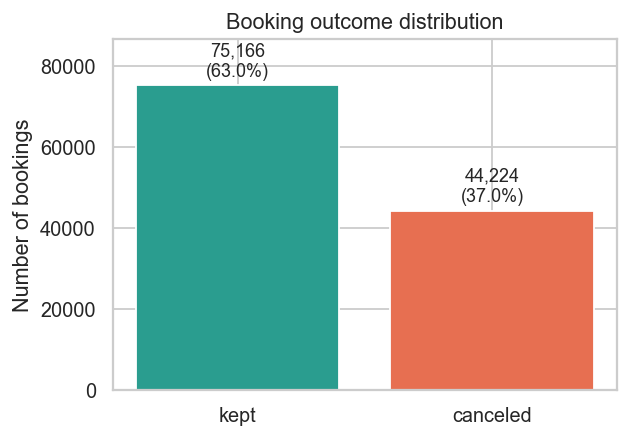
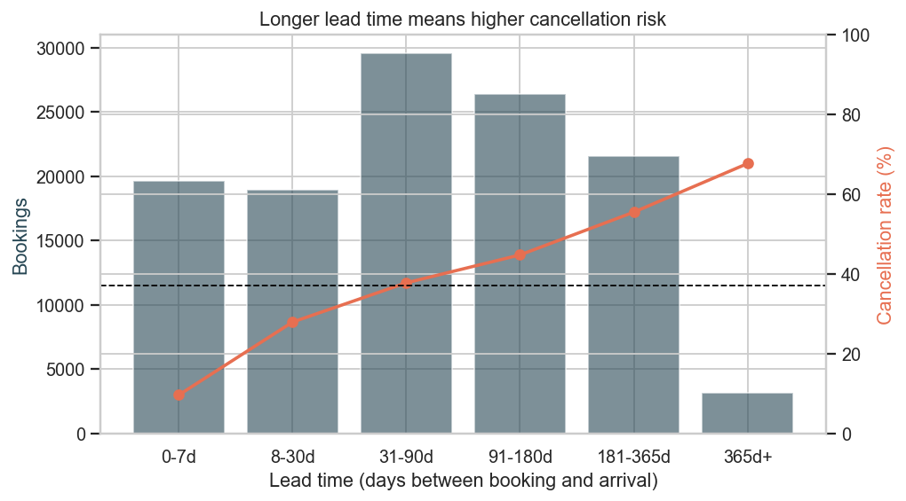
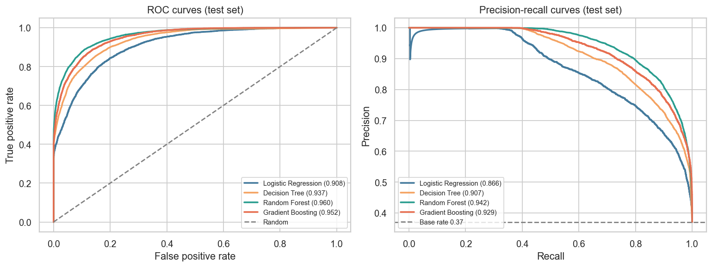
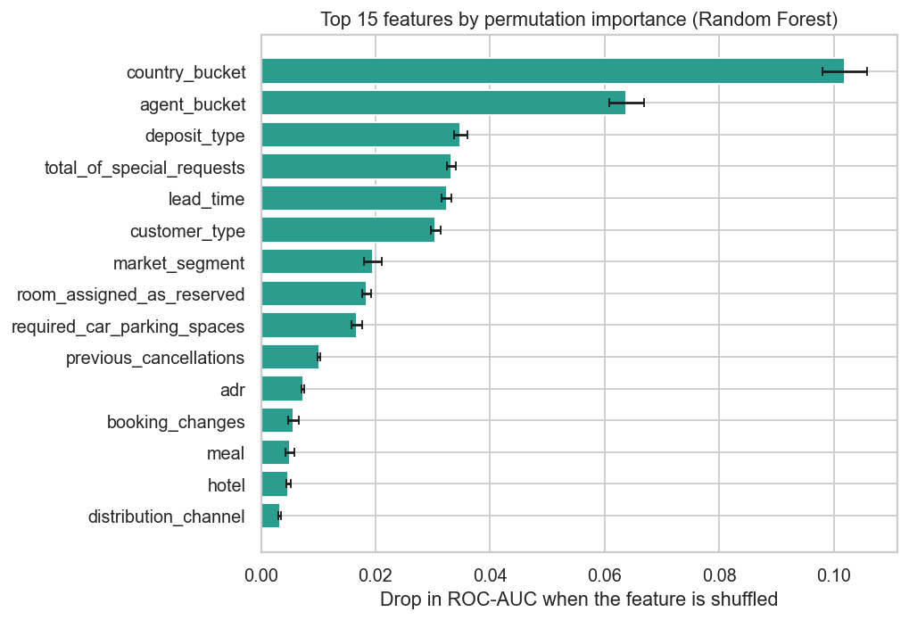
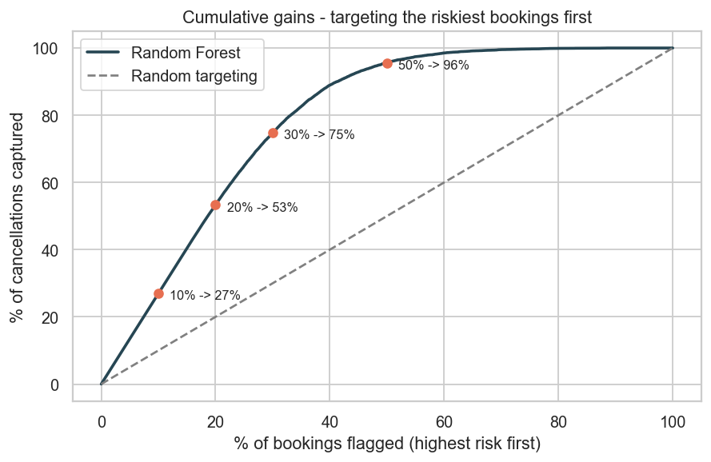

## Predicting Hotel Booking Cancellations

**Author:** Siva Prasad Ampavatina

### Executive summary

Roughly one in three hotel bookings is canceled before the guest ever arrives. That uncertainty is expensive: a room left empty is lost income, and a room oversold (because the hotel overbooked to cover expected cancellations) means turning away a guest who actually showed up. Most hotels manage this today with rough seasonal rules of thumb.

> **Project overview and goals:** This project builds a model that looks at a booking the moment it is made and estimates how likely it is to be canceled, so revenue managers can target overbooking and reconfirmation at the bookings that need it. It uses about 119,000 real bookings from two Portuguese hotels, treats the task as a supervised yes/no (classification) problem, and compares four model types to find the most reliable one.

> **Findings:** The strongest warning signs of a cancellation are a long gap between booking and arrival, a non-refundable deposit (a surprising pattern, explained below), the booking's country and travel-agent source, and the absence of small commitments like a parking request or a special request. Bookings made more than six months ahead cancel over five times as often as last-minute ones. Formal statistical tests confirm these patterns are real rather than chance.

> **Results and conclusions:** The best model, a Random Forest, correctly ranks a canceling booking above a non-canceling one 96% of the time, well ahead of the 63% a "guess nobody cancels" baseline would manage. Put to work, it lets the hotel concentrate attention on the riskiest bookings: reviewing just the riskiest 30% would catch about 75% of all cancellations, far better than treating every booking the same. The recommendation is to use the model as a per-booking risk score for overbooking decisions, after confirming the surprising non-refundable-deposit pattern with the hotel's data team.

### Rationale

Why should anyone care? Cancellations hit a hotel's revenue directly. If managers could see, in advance, which bookings are shaky, they could:

- Set smarter overbooking levels instead of blunt seasonal averages.
- Send reminders or ask for reconfirmation on high-risk bookings.
- Plan staffing and housekeeping with a more realistic view of who will actually arrive.

Better cancellation prediction means fewer empty rooms and fewer guests turned away at the door. Both are wins for the hotel and for guests.

### Research Question

Which booking details best predict whether a reservation will be canceled, and how much better can a model rank bookings by cancellation risk than the hotel's current seasonal-average approach?

### Data Sources

The analysis uses the public **Hotel Booking Demand** dataset:

- Antonio, N., Almeida, A. and Nunes, L. (2019). *Hotel booking demand datasets.* Data in Brief, 22, 41-49.
- About 119,000 bookings from one resort hotel and one city hotel in Portugal, with arrival dates from July 2015 to August 2017.
- Each row is one booking with 31 details: how far ahead it was made, the room and meal type, the deposit terms, the booking channel and travel agent, the guest's country, the price per night, and whether the booking was eventually canceled.
- A public copy is mirrored at the [Tidy Tuesday repository](https://github.com/rfordatascience/tidytuesday/blob/master/data/2020/2020-02-11/readme.md). A local copy is in `data/hotel_bookings.csv`.

The outcome we predict is `is_canceled` (1 = canceled, 0 = the guest checked in). About 37% of bookings were canceled, so the data leans toward "not canceled" but not overwhelmingly. The chart below shows the split.



### Methodology

This is a **supervised classification** problem: every historical booking already carries a known yes/no cancellation label, and we want a model that predicts that label for new bookings. The model's output is a cancellation probability the hotel can rank and act on.

**1. Cleaning the data.** Real booking data is messy, so the first notebook fixes several issues:

- Dropped the `company` column (empty for 94% of bookings).
- Filled small gaps: missing travel agent became "no agent", missing country became "unknown", and four missing children counts became zero.
- Removed 181 impossible rows (180 bookings with zero guests, one with a negative room rate) and capped one extreme price-per-night data-entry error.
- Merged two labels for the same meal type that the documentation says are identical.

**2. Building useful features.** A few new columns were created from the raw data, such as total nights, total guests, whether the family included children, and whether the room finally assigned matched the room reserved. The country and travel-agent fields had hundreds of values, so we kept the 15 most common of each and grouped the rest as "other".

**3. Avoiding cheating (data leakage).** Two columns (`reservation_status` and its date) simply restate the outcome, so any model using them would "cheat". They were identified and excluded from the model. This is an important honesty check.

**4. Splitting and encoding.** The data was split 80% for training and 20% for a held-out test set, keeping the same cancellation rate in both. Numeric values were standardized and categorical values were one-hot encoded inside a pipeline, so the test set never influences how the training data is prepared.

**5. Modeling.** Four model types covered in the program were trained and compared: Logistic Regression (a simple linear model), a Decision Tree, a Random Forest, and Gradient Boosting (the last two combine many trees). Each was checked with 5-fold cross-validation and then tuned with a grid search over its key settings.

**6. Choosing a metric.** The main score is **ROC-AUC**, which measures how well the model ranks bookings by risk. We chose it because the hotel does not need a rigid yes/no for each booking; it needs a trustworthy ranking so it can focus on the riskiest bookings first. ROC-AUC is also not fooled by the class imbalance the way plain accuracy is. We also report precision and recall, which describe the trade-off between false alarms and missed cancellations.

### Results

**The patterns are real, not noise.** Formal statistical tests (chi-square for categories, Mann-Whitney for lead time) confirmed every major relationship is significant. The largest effects, by size rather than just significance, were deposit type and how far ahead the booking was made.

**Lead time is the clearest single signal.** Last-minute bookings rarely cancel; far-ahead bookings cancel often.

| Time between booking and arrival | Bookings | Cancellation rate |
|---|---|---|
| 0-7 days | 19,635 | 9.6% |
| 8-30 days | 18,945 | 27.9% |
| 31-90 days | 29,529 | 37.7% |
| 91-180 days | 26,420 | 44.7% |
| 181-365 days | 21,533 | 55.5% |
| 365+ days | 3,147 | 67.7% |



**Model comparison.** All four models beat the trivial baseline (which would be right 63% of the time by always guessing "not canceled"). The two ensemble models clearly led, and the Random Forest was best.

| Model | Test ROC-AUC | Accuracy | Precision (canceled) | Recall (canceled) |
|---|---|---|---|---|
| **Random Forest** (best) | **0.960** | 0.89 | 0.85 | 0.86 |
| Gradient Boosting | 0.951 | - | - | - |
| Decision Tree | 0.934 | - | - | - |
| Logistic Regression | 0.908 | - | - | - |



The Random Forest correctly ranks a canceling booking above a non-canceling one about 96% of the time. At the default cutoff it catches 86% of real cancellations while keeping false alarms reasonable.

**What the model relies on.** Measuring how much each detail matters (by scrambling it and watching the score fall) gives this ranking: the booking's country and travel-agent source, the deposit type, the number of special requests, the lead time, and the customer type. Guests who make small commitments (a parking space, a special request) almost never cancel.



**A surprise worth flagging.** Common sense says a non-refundable deposit should make people *less* likely to cancel, since they would lose money. In this data the opposite is true: non-refundable bookings cancel 99% of the time, versus about 28% for no-deposit bookings. This is almost certainly a quirk of how this hotel's system records voided reservations rather than real guest behavior, and the hotel should confirm it before relying on it.

**Turning the model into action.** The most useful result for managers is the "cumulative gains" view: if you sort bookings from riskiest to safest and review them from the top down, how many cancellations do you catch?

| Review the riskiest... | You catch this share of all cancellations |
|---|---|
| Top 10% of bookings | 27% |
| Top 20% of bookings | 53% |
| Top 30% of bookings | 75% |
| Top 50% of bookings | 96% |



Reviewing only 30% of bookings to catch 75% of cancellations is a large efficiency gain over treating every booking the same.

### Next steps

- **Confirm the deposit-type finding** with the hotel's data owner before using it in any live decision.
- **Tune the alert threshold to real costs.** The right cutoff depends on how the hotel values an empty room versus a guest turned away; the model can be dialed toward catching more cancellations or raising fewer false alarms.
- **Test on a future time period** (train on 2015-2016, test on 2017) to confirm the model holds up on bookings that come later, not just on a random hold-out.
- **Group block bookings** before splitting, so near-identical tour-operator bookings do not appear in both training and test data.
- **Try a small cost-benefit pilot** on one hotel before a wider rollout.

### Outline of project

- [Notebook 1: Exploratory Data Analysis](1_exploratory_data_analysis.ipynb) - business framing, cleaning, feature engineering, visual analysis, and statistical tests.
- [Notebook 2: Modeling and Evaluation](2_modeling_and_evaluation.ipynb) - model training, cross-validation, grid-search tuning, comparison, and interpretation.
- [Generated charts](images/)
- [Source data](data/hotel_bookings.csv)

To reproduce locally:

```powershell
cd Predict_Hotel_Booking_Cancellation
python -m venv .venv
.\.venv\Scripts\Activate.ps1
pip install -r requirements.txt
```
Run notebook 1 first (it creates the cleaned dataset notebook 2 reads), then notebook 2.

### Contact and Further Information

Siva Prasad Ampavatina (asivap@outlook.com)
